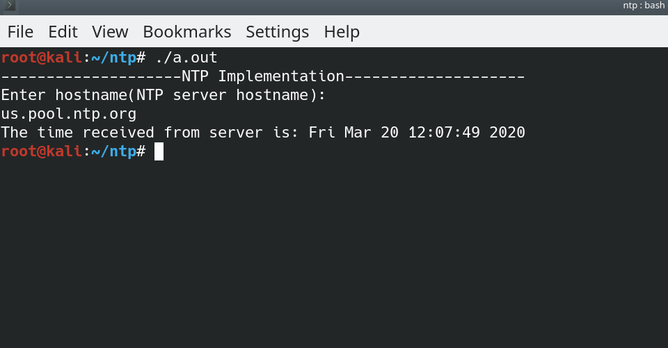

# NTP Client




## What is NTP? 
> The Network Time Protocol (NTP) is a networking protocol for clock synchronization between computer systems over packet-switched, variable-latency data networks. In operation since before 1985, NTP is one of the oldest Internet protocols in current use. NTP was designed by David L. Mills of the University of Delaware.


### Usage 

```
root@linux:~# gcc main.c 
root@linux:~# ./a.out
```

### Resources 

* David Lettier blog. 
* http://www.ntp.org/ 
* [NTP structure format](https://www.meinbergglobal.com/english/info/ntp-packet.htm)

